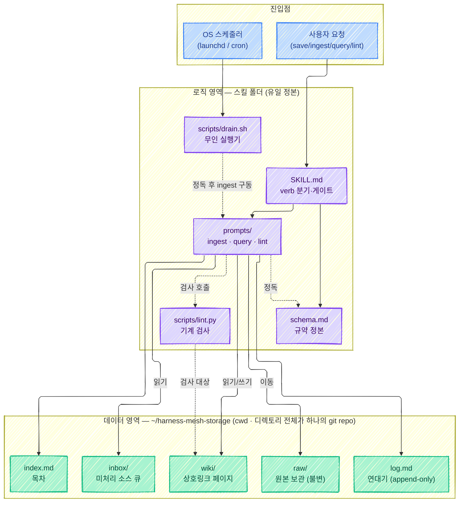
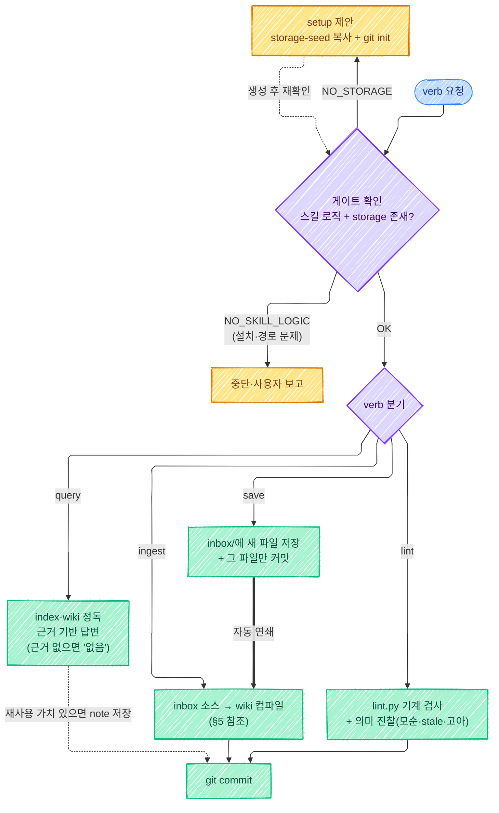
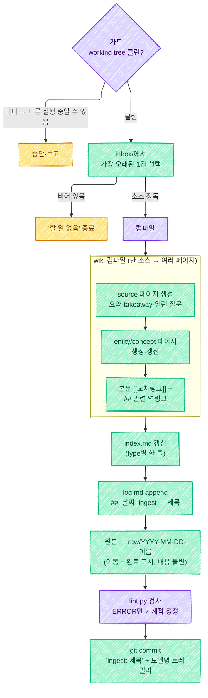
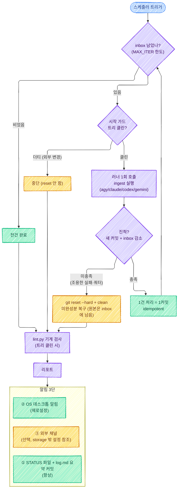

# terroir-harness-mesh — 아키텍처

> 이 문서는 플러그인의 **내부 설계·동작 원리**를 다룬다. 설치와 사용법은 [README.md](./README.md)를 먼저 보라.

평문 마크다운 지식 그물(knowledge mesh) storage를 다루는 스킬 플러그인.
inbox에 던진 자료를 상호링크된 wiki 페이지로 컴파일하고, 근거 기반으로 질의하고, 건강검진까지 하는
4개 동작(`save` / `ingest` / `query` / `lint`)을 제공한다.

핵심 설계 원칙 한 줄: **로직은 스킬에, 데이터는 storage에.** 둘을 물리적으로 분리해 drift(로직 사본이
여러 곳에 생겨 어긋나는 현상)를 원천 차단한다.

## Table of Contents

- [1. 한눈에 보기](#1-한눈에-보기)
- [2. 아키텍처 — 로직/데이터 분리](#2-아키텍처--로직데이터-분리)
- [3. 디렉토리 구조](#3-디렉토리-구조)
- [4. 4개 verb와 게이트 플로우](#4-4개-verb와-게이트-플로우)
- [5. ingest 데이터 플로우 (핵심)](#5-ingest-데이터-플로우-핵심)
- [6. 무인 운용 — drain 루프](#6-무인-운용--drain-루프)
- [7. 페이지 규약 (schema 요약)](#7-페이지-규약-schema-요약)
- [8. git 규약](#8-git-규약)
- [9. 시작하기](#9-시작하기)

---

## 1. 한눈에 보기

| 항목 | 내용 |
|------|------|
| **무엇** | `~/harness-mesh-storage`에 쌓이는 평문 마크다운 지식 베이스 + 그걸 다루는 스킬 |
| **동작(verb)** | `save`(저장) · `ingest`(컴파일) · `query`(질의) · `lint`(건강검진) |
| **데이터 흐름** | `inbox/`(미처리 큐) → **ingest** → `wiki/`(상호링크 페이지) + `raw/`(원본 보관, 불변) |
| **무인 운용** | 스케줄러가 `drain.sh`를 주기 실행해 inbox를 자동 컴파일하는 무인 모드 *(추후 제공 예정 — 현재 미제공)* |
| **저장소** | 로컬 git 전용. push는 사람이 결정 |

> 색 코딩 규칙(아래 모든 다이어그램 공통): **로직=보라**, **데이터=초록**, **진입점/동작=파랑**, **경고/무인=노랑**.

## 2. 아키텍처 — 로직/데이터 분리

이 플러그인의 모든 것은 한 문장에서 나온다 — **로직(`schema.md`·`prompts/`·`scripts/`)은 스킬 폴더에
단 하나의 정본으로 두고, 데이터(`inbox`·`raw`·`wiki`·`index`·`log`)는 고정 위치 storage에만 둔다.**
verb는 스킬의 로직을 *읽고* storage의 데이터에서 *작업*한다. 로직을 storage로 복사하지 않으므로
스킬이 업데이트되면 즉시 반영되고, 사본이 어긋날 일이 없다.



**읽는 법**

- **보라(로직)** 는 절대 storage로 복사되지 않는다 — 스킬 폴더에만 산다. 점선 "정독"은 실행 직전 규약을 읽는 동작.
- **초록(데이터)** 는 storage에만 산다. verb가 cwd를 storage로 잡고 그 안에서만 파일을 만지며, 끝에 git 커밋한다.
- **파랑(진입점)** 2개가 verb를 깨운다 — 사람의 명시 요청, 그리고 무인 스케줄러.

## 3. 디렉토리 구조

```
plugins/terroir-harness-mesh/          ← 로직(스킬) — git으로 배포되는 부분
├── .claude-plugin/plugin.json
└── skills/harness-mesh/
    ├── SKILL.md                       ← verb 분기·게이트(진입 로직)
    ├── schema.md                      ← 규약 정본 (모든 verb가 먼저 정독)
    ├── prompts/{ingest,query,lint}.md ← verb별 실행 절차
    ├── scripts/
    │   ├── lint.py                    ← stdlib only 기계 검사
    │   ├── drain.sh                   ← 무인 inbox 일괄 처리
    │   └── launchd.plist.template     ← mac 스케줄러 템플릿(placeholder)
    └── storage-seed/                  ← setup 시 storage로 복사되는 빈 골격

~/harness-mesh-storage/                ← 데이터(storage) — 로컬 전용, 별도 git repo
├── inbox/   raw/   wiki/
├── index.md   log.md
```

## 4. 4개 verb와 게이트 플로우

모든 verb는 실행 전 **게이트**를 먼저 통과한다 — 로직 경로(`$MESH_SKILL`)와 데이터 경로(`~/harness-mesh-storage`)가
둘 다 있는지 확인한다. 셸은 verb마다 새로 뜨므로(변수가 안 남음) 게이트를 매번 다시 잡는다.



| verb | 입력 | 하는 일 | 산출 |
|------|------|---------|------|
| **save** | 텍스트·파일·URL 메모 | `inbox/`에 슬러그 파일 저장 → **그 파일만** 커밋 → 곧바로 ingest 연쇄 | inbox 파일 + 커밋 |
| **ingest** | inbox 소스 1건(지시 시 최대 3건) | source 페이지 작성 + entity/concept 갱신 + 교차링크 + 원본 raw/ 이동 | wiki 페이지들 + 커밋 |
| **query** | 질문 | index→wiki 정독 후 `[[링크]]` 인용 답변. 근거 없으면 지어내지 않음 | 답변(+선택적 note) |
| **lint** | — | `lint.py` 기계 검사 후 모순·낡은 주장·고아·중복을 의미 진찰 | 수정 + "사람 검토 필요" 목록 |

> **save → ingest 자동 연쇄**가 이 시스템의 심장이다. OS 스케줄러나 hook 없이도 저장 즉시 컴파일되므로
> 어떤 벤더·OS에서도 동일하게 동작한다. ingest가 실패해도 save 커밋은 남아 다음 실행에서 재개된다(idempotent).

## 5. ingest 데이터 플로우 (핵심)

inbox의 소스 1건이 wiki의 상호링크 페이지로 컴파일되는 과정. **원본을 `raw/`로 이동하는 것이 완료 표시**다.



**핵심 불변식**

- 한 소스 → **반드시 source 페이지 1개** + 거기서 언급된 대상마다 entity/concept 페이지.
- 모든 `[[링크]]`는 wiki 내 실재 파일을 가리킨다(아직 없으면 그 줄에 `<!-- stub -->` 표기).
- `raw/`는 **불변** — 이동만 허용, 내용 수정 절대 금지. `inbox→raw`는 한 번뿐인 단방향이다.

## 6. 무인 운용 — drain 루프

> ⚠️ **현재 미제공 — 추후 제공 예정.** 무인 drain은 설계만 완료된 상태로 이번 배포에는 포함되지 않는다(스킬·README에서 비활성). 아래는 **설계 참고용**이며, 현재는 `save` 시 `ingest` 자동 연쇄로 즉시 컴파일된다.

`scripts/drain.sh`는 OS 스케줄러(mac launchd / linux cron)가 부를 때만 도는 무인 실행기다. **기본 OFF** —
사용자가 명시적으로 등록할 때만 동작한다. inbox를 한 건씩 ingest하며, **"새 커밋 생김 + inbox 감소"** 를
진척 판정으로 삼아 러너가 조용히 실패하면 안전하게 멈추고 복구한다.



**안전장치**

- **건당 1처리 → 1커밋, idempotent** — 중단되면 재실행이 곧 재개다.
- **진척 없으면 `git reset --hard` + `clean`** 으로 미완성분만 무손상 복구(원본은 inbox에 그대로 남음).
- **시작 가드** — 트리가 더티면(외부 변경 가능성) reset하지 않고 멈춘다.
- **보안** — 스크립트엔 비밀값·웹훅·토큰 0. 외부 알림 설정은 storage 밖(`~/.config/harness-mesh/` 또는 env)에만 둔다.

## 7. 페이지 규약 (schema 요약)

정본은 `skills/harness-mesh/schema.md`. 핵심만:

**페이지 타입 4종 (고정 — 늘리지 않음)**

| type | 용도 |
|------|------|
| `source` | raw 소스 1건의 요약·takeaway·열린 질문 (ingest마다 1개) |
| `entity` | 사람·도구·프로젝트·조직 등 고유 대상 |
| `concept` | 기법·아이디어·패턴 |
| `note` | query 답변 중 보존 가치 있는 합성물 |

**소유권** — `inbox/`·`raw/`는 사람 소유(에이전트는 읽기/이동만), `wiki/`·`index.md`·`log.md`는 에이전트 관리.

**frontmatter 필수** — `type` · `created` · `updated` · `sources`. 링크 필드(`related`)는 두지 않고 링크는 본문에만.

**파일명·링크** — 슬러그 kebab-case, `wiki/`는 flat(하위폴더 없음), 링크는 `[[슬러그]]`. 모든 페이지는 index.md에 정확히 1번 등재.

## 8. git 규약

- storage를 바꾸는 실행(save·ingest·자동수정 lint·note 저장 query)은 **git commit으로 마무리**한다 — git이 감사·복구·동시성 탐지 층.
- 실행 시작 시 트리가 더러우면(미커밋 변경) 다른 실행 중일 수 있으므로 **중단·보고**.
- 커밋 메시지: `ingest: <제목>` / `query: <제목>` / `lint: <요약>`, 트레일러에 실행한 실제 모델명.
- **push 금지** — 로컬 전용. 원격 연결은 사람이 결정.

## 9. 시작하기

1. **플러그인 설치** — terroir 플러그인 마켓에서 `terroir-harness-mesh`를 활성화한다.
   - **Windows 사용자(전제조건)**: 이 플러그인의 스크립트는 bash로 동작한다. [Git for Windows](https://git-scm.com/download/win)를 설치하고, Claude Code가 bash를 못 찾으면 환경변수 `CLAUDE_CODE_GIT_BASH_PATH`에 `bash.exe` 경로를 지정한다(예: `C:\Program Files\Git\bin\bash.exe`). WSL을 써도 되며, 이 경우 storage는 WSL 홈(`~/harness-mesh-storage`)에 생성된다(Windows 홈과 분리됨).
2. **storage 생성** — 아무 verb나 부르면 게이트가 `NO_STORAGE`를 감지하고 setup을 제안한다.
   승인하면 `storage-seed/`가 `~/harness-mesh-storage`로 복사되고 `git init`된다.
3. **자료 저장** — "이거 mesh에 저장해줘"로 `save` → 자동으로 `ingest`까지 연쇄돼 wiki 페이지가 생긴다.
4. **질의** — "mesh에서 ~ 찾아줘" / "mesh에 물어봐"로 `query`. 근거 없으면 "근거 없음"으로 정직하게 답한다.
5. **(예정) 무인 drain** — inbox를 주기 자동 컴파일하는 무인 모드는 *추후 제공 예정(현재 미제공)*. 지금은 save→ingest 자동 연쇄로 즉시 컴파일되므로 불필요하다. 설계는 §6 참조.

> 데이터는 평문 마크다운이라 Obsidian으로 열면 그래프 뷰를 그대로 쓸 수 있다(`.obsidian/`은 git 제외).
