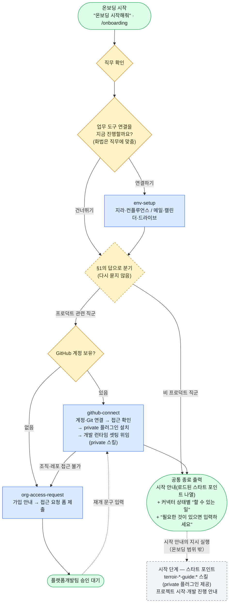

# terroir-onboarding

> Terroir를 처음 시작하는 사람을 위한 **온보딩 진입점 플러그인**.
> 사전 인증 없이 설치할 수 있다.

## 설치

```
/plugin marketplace add VntgCorp/terroir-claude-plugin-public
/plugin install terroir-onboarding@terroir-claude-plugin-public
```

## 사용

```
온보딩 시작해줘
```

또는 `/onboarding`.

## 제공 skill

| skill | 설명 |
| --- | --- |
| `onboarding` | 온보딩 진입점. 직무 확인 → 환경 셋팅 → 직무별 경로 안내 → 시작 안내·커넥터 상태 출력 |
| `env-setup` | 공통 업무 환경 셋팅 — 지라·컨플루언스 / 메일·캘린더·드라이브 연결 점검·안내 |
| `github-connect` | GitHub 계정 연결 → Git 연결 → 사내 플러그인 접근 확인·설치 (승인 후 이어받기 포함) |
| `org-access-request` | 조직 계정이 없는 경우 가입 안내와 접근 요청 폼 안내(사용자가 직접 제출), 대기 안내 |

## 온보딩 플로우

스킬 간 분기 수준의 전체 흐름이다. 각 스킬의 내부 절차는 해당 SKILL.md가 유일한 진실이다. 온보딩을 완주한 경로의 종착점은 `onboarding`의 공통 종료 출력이다. 조직 접근 승인이 필요한 경로는 종료 출력 없이 대기 상태로 멈췄다가, 승인 후 재개 문구를 받아 `github-connect`로 이어진다.

종료 출력은 두 블록의 조합이다 — 시작 안내(세션에 로드된 스타트 포인트 `terroir-*-guide:*` 스킬 나열, 없으면 설치 여부와 직무에 따라 자리를 비우거나 안내 한 줄로 대체) + 커넥터 상태별 "할 수 있는 일"(연결/미연결 런타임 확인). 스타트 포인트는 private 플러그인이 제공하므로, 추가돼도 이 플러그인의 문서는 바뀌지 않는다. 시작 단계(프로젝트 시작·개발 진행 안내)는 온보딩 범위 밖이다.


