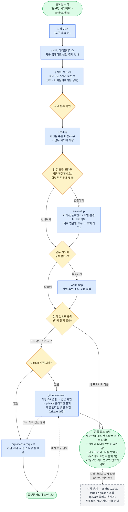

# terroir-onboarding

> Terroir를 처음 시작하는 사람을 위한 **온보딩 진입점 플러그인**.
> 업무 도구·GitHub 연결, 사내 플러그인 설치, 업무 지도 등록까지 안내한다.
> 사전 인증 없이 설치할 수 있다.

## 설치

```
/plugin marketplace add VntgCorp/terroir-claude-plugin-public
/plugin install terroir-onboarding@terroir-claude-plugin-public
```

## 자동 업데이트 설정

`/onboarding`을 실행하면 가장 먼저 `terroir-claude-plugin-public`의 사용자 전역 설정을
`autoUpdate: true`로 바꾸고 결과를 안내한다. 프로덕트 직군이 private 플러그인 설치까지
진행하면 `terroir-claude-plugin`에도 같은 설정을 적용한다. 기존 설정과 마켓플레이스 채널은
보존하며, 설정 실패가 나머지 온보딩을 막지는 않는다.

## 사용

```
온보딩 시작해줘
```

또는 `/onboarding`.

## 업무 지도

자주 쓰는 곳을 사용자 폴더의 파일 하나에 모아 두고, 세션마다 Claude 가 그 목차를 먼저 알고 시작하게 한다.

- **파일:** `~/.claude/terroir/work-map.md` (`CLAUDE_CONFIG_DIR` 가 있으면 그 아래 `terroir/work-map.md`). 레포 밖이라 커밋되지 않는다.
- **기본 칸:** 프로파일(이메일·자신을 부를 이름·직무 분류·직무) · 지라·컨플루언스 프로젝트 · 자주 쓰는 채널 · 자주 대화하는 사람 · GitHub 프로젝트 · 드라이브 주소 · 규칙 위치. 사용자가 요청하면 칸을 더 만든다.
- **세션 시작 훅:** 새 세션마다 지도 경로와 칸 제목·"언제 읽나" 한 줄만 세션에 넣는다. 값은 Claude 가 그 칸에 해당하는 일을 할 때 파일을 열어 읽는다.
- **만들고 고치기:** `/work-map`, 또는 "업무 정보 등록해줘", "지도 고쳐줘", "이것도 지도에 넣어줘". 온보딩도 프로파일 저장과 등록 단계에서 이 스킬을 쓴다.
- **조회 대기:** 업무 도구를 방금 연결한 세션에서는 그 도구가 아직 보이지 않는다. 연결한 도구를 지도에 "조회 대기"로 적어 두고, 다음 세션에 훅이 후보 조회를 한 번 제안한다.

지도에는 어디에 무엇이 있는지(주소·ID·사람)만 둔다. 일하는 방식·판단·피드백은 Claude Code 메모리에 남긴다.

## 온보딩 플로우

스킬 간 분기 수준의 전체 흐름이다. 각 스킬의 내부 절차는 해당 SKILL.md가 유일한 진실이다.
시작 인사를 도구 호출보다 먼저 출력하고, Public 자동 업데이트 설정은 모든 분기보다 먼저 실행하고, 그 다음 설치된 것 소개를 1회 출력한다. 온보딩을 완주한 경로의 종착점은
`onboarding`의 공통 종료 출력이다. 조직 접근 승인이 필요한 경로는 종료 출력 없이 대기 상태로
멈췄다가, 승인 후 재개 문구를 받아 `github-connect`로 이어진다.

종료 출력은 두 블록의 조합이다 — 시작 안내(세션에 로드된 스타트 포인트 `terroir-*-guide:*` 스킬 나열, 없으면 설치 여부와 직무에 따라 자리를 비우거나 안내 한 줄로 대체) + 커넥터 상태별 "할 수 있는 일"(연결/미연결 런타임 확인). 스타트 포인트가 설치된 경로에서는 여기에 마무리 두 줄(`/reload-plugins` 안내 + 리로드 뒤 물어볼 문장)이 따라붙는다. 스타트 포인트는 private 플러그인이 제공하므로, 추가돼도 이 플러그인의 문서는 바뀌지 않는다. 시작 단계(프로젝트 시작·개발 진행 안내)는 온보딩 범위 밖이다.


```mermaid
flowchart TD
    START(["온보딩 시작<br/>&quot;온보딩 시작해줘&quot; · /onboarding"])
    HELLO["시작 인사<br/>(도구 호출 전)"]
    AUTO["public 마켓플레이스<br/>자동 업데이트 설정·결과 안내"]
    INTRO["설치된 것 소개<br/>플러그인 3개가 하는 일<br/>(1회 · 이어받기에서는 생략)"]

    Q1{"직무 분류 확인"}
    PROF["프로파일<br/>자신을 부를 이름·직무<br/>→ 업무 지도에 저장"]
    Q2{"업무 도구 연결을<br/>지금 진행할까요?<br/>(화법은 직무에 맞춤)"}
    ENV["env-setup<br/>지라·컨플루언스 / 메일·캘린더·드라이브<br/>(새로 연결한 도구 → 조회 대기)"]
    QM{"업무 지도에<br/>등록할까요?"}
    MAP["work-map<br/>칸별 후보 조회·직접 입력"]
    BR{"§1의 답으로 분기<br/>(다시 묻지 않음)"}
    Q3{"GitHub 계정 보유?"}

    GH["github-connect<br/>계정·Git 연결 → 접근 확인<br/>→ private 플러그인 설치<br/>→ 개발 런타임 셋팅 위임(private 스킬)"]
    OA["org-access-request<br/>가입 안내 → 접근 요청 폼 제출"]
    WAIT(["플랫폼개발팀 승인 대기"])

    END(["공통 종료 출력<br/>시작 안내(로드된 스타트 포인트 나열)<br/>+ 커넥터 상태별 &quot;할 수 있는 일&quot;<br/>+ 리로드 안내 · 다음 발화 안내(스타트 포인트 설치 시)<br/>+ &quot;필요한 것이 있으면 입력하세요&quot;"])
    SP["시작 단계 — 스타트 포인트<br/>terroir-*-guide:* 스킬 (private 플러그인 제공)<br/>프로젝트 시작·개발 진행 안내"]

    START --> HELLO
    HELLO --> AUTO
    AUTO --> INTRO
    INTRO --> Q1
    Q1 --> PROF
    PROF --> Q2
    Q2 -->|연결하기| ENV
    Q2 -->|건너뛰기| QM
    ENV --> QM
    QM -->|등록하기| MAP
    QM -->|나중에| BR
    MAP --> BR

    BR -->|프로덕트 관련 직군| Q3
    BR -->|비 프로덕트 직군| END

    Q3 -->|있음| GH
    Q3 -->|없음| OA
    GH -->|조직·레포 접근 불가| OA
    OA --> WAIT
    WAIT -.->|재개 문구 입력| GH

    GH --> END
    END -.->|시작 안내의 지시 실행<br/>（온보딩 범위 밖）| SP

    classDef skill fill:#dbeafe,stroke:#2563eb,color:#0b1b3a
    classDef gate fill:#fef3c7,stroke:#d97706,color:#3a2a05
    classDef term fill:#dcfce7,stroke:#16a34a,color:#0a2612
    classDef branch fill:#fef3c7,stroke:#d97706,color:#3a2a05,stroke-dasharray:5 4
    classDef ext fill:#f3f4f6,stroke:#6b7280,color:#1f2937,stroke-dasharray:5 4
    class HELLO,AUTO,INTRO,PROF,ENV,MAP,GH,OA skill
    class Q1,Q2,QM,Q3 gate
    class BR branch
    class START,END,WAIT term
    class SP ext
```
